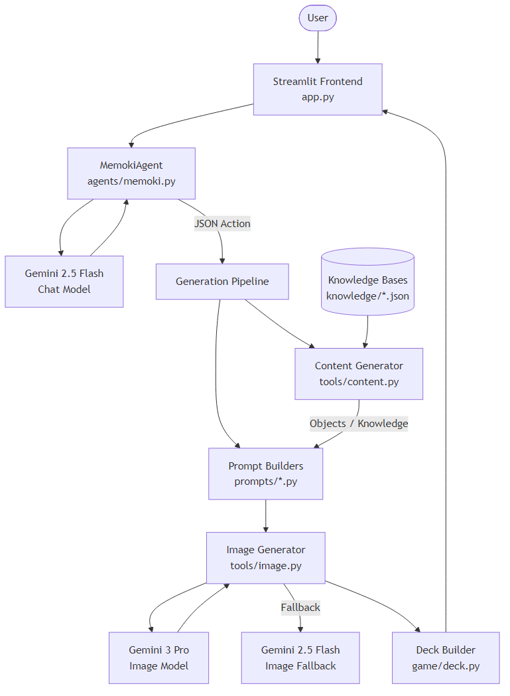
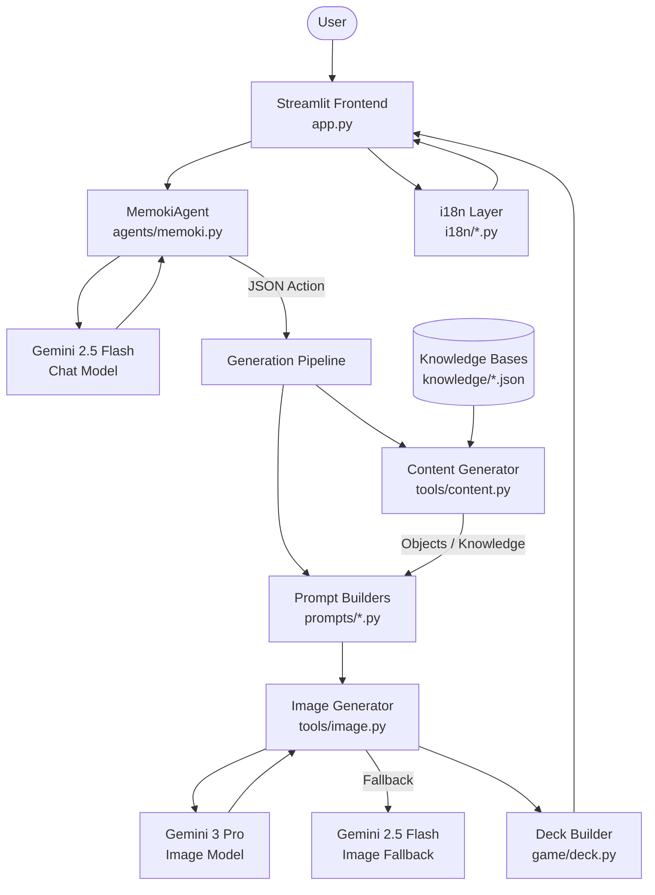

# MEMOKI -- Architecture Documentation

## Overview

MEMOKI is a bilingual (German/English) AI Memory card game generator. The user selects a game mode, chats with an AI agent to specify parameters (theme, art style, audience), and the system generates a complete deck of illustrated Memory cards using Google Gemini models.

The app features a full internationalization (i18n) system with language-specific knowledge bases, allowing seamless switching between German and English UI and content.

### System Architecture



<details>
<summary>Mermaid source (renders on GitHub)</summary>



</details>

---

## Application Flow

```
1. Mode Selection       User picks one of 5 game modes in the sidebar
        |
2. Chat Phase           MemokiAgent greets user, asks for theme/style/audience
        |
3. Parameter Collection Agent outputs a JSON action block when all info is gathered
        |
4. Content Loading      Load objects from LLM or knowledge bases
        |
5. Prompt Building      Build optimized image prompts for each card
        |
6. Image Generation     Parallel generation via ThreadPoolExecutor (max 5 workers)
        |
7. Deck Assembly        Build card pairs, shuffle deck
        |
8. Display              Preview mode (all cards visible) or Play mode (Memory game)
        |
9. Download             Export cards as ZIP file
```

---

## Components

### app.py -- Streamlit Frontend

**Size**: ~950 lines | **Role**: Main application entry point

The frontend uses a two-column layout:
- **Left column**: Mode selection cards (5 modes), chat interface
- **Right column**: Game board (preview or play mode)
- **Sidebar**: Language selector (Deutsch/English via `st.pills`), mode navigation

**Key responsibilities**:
- Renders the mode selection UI with animated CSS cards
- Manages chat interface with the MemokiAgent
- Parses JSON action blocks from agent responses to trigger generation
- Orchestrates the parallel image generation pipeline
- Displays the game board in two modes:
  - **Preview**: Cards sorted by pair, all face-up, side-by-side comparison
  - **Play**: Interactive Memory game with flip mechanics, match validation, move counting
- Provides ZIP download of generated card images

**State management** via `st.session_state`:

| Key | Type | Purpose |
|-----|------|---------|
| `selected_mode` | str | Currently active game mode |
| `agent` | MemokiAgent | Chat orchestrator instance |
| `messages` | list | Chat history |
| `deck` | Deck | Generated card deck |
| `generating` | bool | Generation in progress flag |
| `flipped` | set | Card indices currently face-up |
| `matched` | set | Pair IDs that have been matched |
| `first_pick` | int or None | Index of first card clicked |
| `moves` | int | Total moves in current game |
| `view_mode` | str | "preview" or "play" |
| `lang` | str | Current UI language ("de" or "en") |

### app_test.py -- Test / Preview Mode

**Size**: ~830 lines | **Role**: QA testing version

A stripped-down copy of `app.py` with these differences:
- All cards are immediately face-up (no game logic)
- Cards sorted by `pair_id` for visual pair inspection
- Uses 8 pairs instead of 10 (faster generation)
- Sidebar collapsed by default
- Title shows "TEST-MODUS"

Run with: `streamlit run app_test.py`

---

### agents/memoki.py -- Chat Agent

**Size**: 158 lines | **Role**: Conversational orchestration

The `MemokiAgent` class manages the conversation with the user using Gemini 2.5 Flash.

**System prompt** responsibilities:
- Guides the user through mode-specific parameter collection
- Knows which parameters to ask for per mode (see table below)
- Outputs a JSON action block when all parameters are collected

| Mode | Theme | Style | Audience | Shape |
|------|-------|-------|----------|-------|
| Classic | User's choice (free text) | Yes | Yes | -- |
| Pairs | From fixed list (10 themes) | Yes | Yes | -- |
| Teekesselchen | Not needed (curated list) | Yes | Yes | -- |
| Math Abstract | Not needed | Yes | Yes | User's choice (6 options) |
| Math Concrete | User's choice (countable objects) | Yes | Yes | -- |

**JSON action block** format:
```json
{
  "action": "generate",
  "theme": "animals",
  "style": "cartoon",
  "audience": "children",
  "shape": "circles"
}
```

The `parse_action()` static method extracts JSON from markdown code fences and validates it.

---

### config/settings.py -- Configuration

**Size**: 29 lines | **Role**: Centralized settings

Reads API keys from Streamlit Secrets (cloud) or `.env` (local) via the `_get_secret()` helper.

| Setting | Value | Purpose |
|---------|-------|---------|
| `GOOGLE_API_KEY` | From env | API key for all Gemini models |
| `GOOGLE_CHAT_MODEL` | `gemini-2.5-flash` | Agent chat model |
| `GOOGLE_IMAGE_MODEL` | `gemini-3-pro-image-preview` | Primary image generation |
| `GOOGLE_IMAGE_MODEL_FAST` | `gemini-2.5-flash-image` | Fallback image generation |
| `DEFAULT_PAIR_COUNT` | 6 | Default number of card pairs |
| `IMAGE_SIZE` | `1024x1024` | Generated image dimensions |

---

### game/ -- Game Data Models

#### game/card.py -- Card

A `@dataclass` representing a single Memory card:

| Field | Type | Description |
|-------|------|-------------|
| `pair_id` | int | Shared by both cards in a pair |
| `label` | str | Display text (e.g. "5", "Bank (Sitzbank)") |
| `image` | PIL.Image or None | Generated card image |
| `is_revealed` | bool | Whether the card is currently face-up |

#### game/deck.py -- Deck

The `Deck` class holds a list of `Card` objects and provides five class-method builders:

| Builder | Mode | Card A | Card B |
|---------|------|--------|--------|
| `build_classic()` | Classic | Image of object | Identical image |
| `build_paare()` | Pairs | Image of object A | Image of related object B |
| `build_teekesselchen()` | Teekesselchen | Meaning A image | Meaning B image |
| `build_mathe_abstrakt()` | Math Abstract | Number image | Shape image (N shapes) |
| `build_mathe_konkret()` | Math Concrete | Number image | Object image (N objects) |

All builders shuffle the deck before returning.

#### game/session.py -- GameSession

Tracks game state: `deck`, `moves`, `pairs_found`, `is_finished`.

---

### generators/ -- Image Generator Interface

#### generators/base.py -- Abstract Base Class

Defines the `ImageGenerator` ABC with a single abstract method:
```python
def generate(self, prompt: str) -> Image.Image
```

#### generators/nano_banana.py -- Gemini Implementation

`NanoBananaGenerator` implements `ImageGenerator` using Gemini 3 Pro's native image generation via `response_modalities=["IMAGE"]`.

> **Note**: In practice, `app.py` uses `tools/image.py:generate_card_image()` directly (which includes fallback logic) rather than this class. The generator class exists as a clean abstraction for potential future backends.

---

### tools/content.py -- Content Generation & Knowledge Base Loaders

**Size**: 303 lines | **Role**: Generates object lists and loads curated data

#### LLM-based generation

| Function | Purpose | Used by |
|----------|---------|---------|
| `generate_objects()` | Generates a list of visually distinct objects for a theme | Classic mode |
| `generate_countable_objects()` | Generates discrete, countable objects suitable for 1-10 on a card | Math Concrete mode |

Both functions call Gemini 2.5 Flash with detailed prompts that include good/bad examples and return a JSON array of English object names.

#### Knowledge base loaders

| Function | File | Returns |
|----------|------|---------|
| `load_teekesselchen(count, lang)` | `teekesselchen_{lang}.json` | Random selection of homophones from language-specific knowledge base (fallback: DE) |
| `load_pairs(theme, count)` | `pairs_v2.json` | Random selection of object pairs for a theme |
| `load_pairs_themes()` | `pairs_v2.json` | List of available theme names |
| `load_math_shape(shape_id)` | `math_shapes.json` | Shape definition dict (supports "surprise" = random) |

---

### tools/image.py -- Image Prompt Builder & Generator

**Size**: 90 lines | **Role**: Build optimized prompts and generate images

#### Prompt building

`build_image_prompt(subject, style, audience)` assembles a prompt string from:

**Style mapping** (`STYLE_MAP`):

| Key | Prompt fragment |
|-----|----------------|
| `cartoon` | cartoon illustration style, bold outlines, vibrant colors |
| `photorealistic` | photorealistic, high detail, professional photography |
| `watercolor` | watercolor painting style, soft edges, pastel colors |
| `minimalist` | minimalist flat design, simple shapes |
| `artistic` | painterly illustration, soft brushstrokes |
| `black-and-white` | grayscale, pencil sketch style |
| `pencil` | pencil drawing, hand-sketched, graphite on paper |
| `retro` | retro vintage illustration, 1970s aesthetic |
| `pixel` | pixel art style, 8-bit retro game aesthetic |
| `comic` | comic book illustration, bold ink outlines, halftone dots |
| *(custom)* | Passed through as-is (e.g. "van Gogh post-impressionist style") |

**Audience mapping** (`AUDIENCE_MAP`):

| Key | Prompt fragment |
|-----|----------------|
| `children` | bright cheerful colors, friendly appearance |
| `teenagers` | cool modern aesthetic, trendy colors |
| `adults` | sophisticated, elegant, refined details |

All prompts end with: centered on pure white background, no text, square format.

#### Image generation

`generate_card_image(prompt, use_fast=False)`:
- **Primary**: Gemini 3 Pro (`gemini-3-pro-image-preview`) -- high quality
- **Fallback**: Gemini 2.5 Flash (`gemini-2.5-flash-image`) -- faster, lower cost
- Returns a `PIL.Image` object
- The app uses `ThreadPoolExecutor(max_workers=5)` for parallel generation

---

### prompts/ -- Mode-Specific Prompt Builders

#### prompts/classic_memory.py

`ClassicPromptBuilder` -- thin wrapper around `build_image_prompt()`. Takes a subject and returns a standard card prompt.

#### prompts/pairs_memory.py

`build_pair_object_prompt()` -- specialized prompt for related objects with **anti-morphing constraints**:
- "do NOT reshape it into an animal, whale, duck, character, or toy"
- "do NOT add faces, eyes, or animal features to the object"

This prevents Gemini from turning objects (e.g. a pot) into cute animal characters.

#### prompts/teekesselchen.py

`TeekesselchenPromptBuilder` -- thin wrapper around `build_image_prompt()`. Passes the English meaning description from the knowledge base.

#### prompts/math_memory.py

**Size**: 318 lines | **Role**: Complex prompt builders for math cards

The most sophisticated prompt module, containing:

| Function | Purpose |
|----------|---------|
| `build_number_prompt()` | Large bold digit card with theme-inspired colors |
| `build_shapes_prompt()` | N shapes arranged in a grid layout |
| `build_real_objects_prompt()` | N real objects arranged in a grid layout |
| `_layout_hint(n)` | Explicit grid arrangements (e.g. "3 top row, 2 bottom row" for 5) |
| `_dice_prompt(n)` | Classic dice pip patterns, 1-6 per die, multiple dice for 7+ |
| `_tally_prompt(n)` | Tally mark system (4 vertical + 1 diagonal = 5) |
| `_domino_prompt(n)` | Domino tiles with split-half pip patterns |

**Special handling**:
- **Fingers**: Uses hand descriptions (one hand for 1-5, two hands for 6-10)
- **Dice/Tally/Domino**: Custom prompt builders instead of generic shape rendering
- **Number cards**: Explicit constraint to prevent reshaping digits into themed objects
- **Count verification**: All prompts include "IMPORTANT: total must be exactly N"

---

## Knowledge Bases

### Teekesselchen / Homonym Knowledge Bases

MEMOKI uses **language-specific** homonym knowledge bases. Homonyms cannot be translated -- "Schloss" (castle/door lock) has no English equivalent, "Bat" (animal/baseball bat) has no German one.

#### teekesselchen_de.json -- German Homonyms

130 curated German homophones (words with multiple meanings), each with:

```json
{
  "id": 1,
  "word": "Bank",
  "meaning_a": { "de": "Sitzbank", "en": "wooden park bench", "prompt": "wooden park bench in a park" },
  "meaning_b": { "de": "Geldinstitut", "en": "bank building exterior", "prompt": "bank building exterior with columns" }
}
```

- Source: deutschmeisterei.de, mijan.de, manual curation
- Criteria: Both meanings must be visually depictable, child-friendly, no abstract concepts

#### teekesselchen_en.json -- English Homonyms

119 curated English homonyms, same structure:

```json
{
  "id": 1,
  "word": "Bat",
  "meaning_a": { "de": "Fledermaus", "en": "bat (animal)", "prompt": "small flying bat animal with spread wings at night" },
  "meaning_b": { "de": "Baseballschläger", "en": "baseball bat", "prompt": "wooden baseball bat" }
}
```

- Source: manually curated
- The `prompt` field (always English) is used for image generation; `de`/`en` labels are used for the UI
- `load_teekesselchen(count, lang)` automatically selects the correct file based on the current language

### pairs_v2.json

10 themed categories, each with 15+ curated object pairs:

| Theme (DE) | Theme (EN) | Example pair |
|------------|------------|-------------|
| Kuche | Kitchen | Topf (pot) & Deckel (lid) |
| Buro | Office | Kugelschreiber (pen) & Notizblock (notepad) |
| Sport | Sports | Tennisschlager (racket) & Tennisball |
| Haushalt | Household | Schlussel (key) & Schloss (lock) |
| Musik | Music | Gitarre (guitar) & Plektrum (pick) |
| Garten | Garden | Giesskanne (watering can) & Blumentopf (flower pot) |
| Bad | Bathroom | Zahnburste (toothbrush) & Zahnpasta (toothpaste) |
| Schule | School | Bleistift (pencil) & Radiergummi (eraser) |
| Verkehr | Transport | Ampel (traffic light) & Zebrastreifen (crosswalk) |
| Tiere | Animals | Hund (dog) & Knochen (bone) |

### math_shapes.json

20+ shape variations organized into 5 categories:

| Category | Shapes |
|----------|--------|
| Geometric | circles, squares, triangles, diamonds, hexagons |
| Nature | stars, flowers, leaves, drops, suns |
| Objects | hearts, buttons, coins, gems, balloons |
| Hands & Dice | fingers, dice, domino |
| Tally & Blocks | tally marks, building blocks |

The special `"surprise"` shape ID picks randomly from a curated pool.

---

## Image Generation Pipeline

```
app.py (on JSON action received)
  |
  +--> Load content
  |      Classic:        generate_objects() via LLM
  |      Pairs:          load_pairs() from JSON
  |      Teekesselchen:  load_teekesselchen(count, lang) from language-specific JSON
  |      Math Abstract:  load_math_shape() from JSON + numbers 1..N
  |      Math Concrete:  generate_countable_objects() via LLM + numbers 1..N
  |
  +--> Build prompts (mode-specific prompt builder)
  |
  +--> ThreadPoolExecutor (max_workers=5)
  |      +--> generate_card_image(prompt, use_fast=False)
  |      |      Primary:  Gemini 3 Pro
  |      |      Fallback: Gemini 2.5 Flash (on failure)
  |      +--> ... (parallel for all cards)
  |
  +--> Deck.build_*() assembles Card objects with images
  |
  +--> UI displays progress bar, warnings for fallbacks
```

**Progress tracking**: `st.progress()` updates per image, with warnings for fallback usage.

---

## Game Modes in Detail

### 1. Classic Memory

- **Data source**: `generate_objects()` (LLM generates themed object list)
- **Prompt builder**: `ClassicPromptBuilder` -> `build_image_prompt()`
- **Deck structure**: Each object appears twice with identical images
- **User inputs**: Theme (free text), Style, Audience

### 2. Pairs Memory

- **Data source**: `load_pairs(theme, count)` from `pairs_v2.json`
- **Prompt builder**: `build_pair_object_prompt()` with anti-morphing constraints
- **Deck structure**: Object A paired with related Object B (different images)
- **User inputs**: Theme (from fixed list of 10), Style, Audience

### 3. Teekesselchen / Teapot Memory

- **Data source**: `load_teekesselchen(count, lang)` from `teekesselchen_{lang}.json` (DE: 130 entries, EN: 119 entries)
- **Prompt builder**: `TeekesselchenPromptBuilder` -> `build_image_prompt()`
- **Deck structure**: Meaning A paired with Meaning B (same word, different images)
- **User inputs**: Style, Audience (no theme needed)
- **Language-specific**: German UI loads German homonyms, English UI loads English homonyms

### 4. Math Memory I (Abstract)

- **Data source**: `load_math_shape(shape_id)` + numbers 1..N
- **Prompt builder**: `build_number_prompt()` + `build_shapes_prompt()`
- **Deck structure**: Number card paired with shape card showing that many shapes
- **User inputs**: Shape style (circles/stars/hearts/dice/fingers/surprise), Style, Audience
- **Special**: Dice, tally, domino, and fingers use custom prompt builders

### 5. Math Memory II (Concrete)

- **Data source**: `generate_countable_objects()` (LLM) + numbers 1..N
- **Prompt builder**: `build_number_prompt()` + `build_real_objects_prompt()`
- **Deck structure**: Number card paired with object card (different object per number)
- **User inputs**: Theme (countable objects), Style, Audience

---

## Prompt Engineering Highlights

### Anti-morphing constraints

Gemini tends to turn objects into cute characters. The pairs mode prompt explicitly forbids this:
> "do NOT reshape it into an animal, whale, duck, character, or toy"

### Layout hints for counting

For math cards, explicit grid arrangements ensure correct counts:
- 5 objects: "3 top row, 2 bottom row"
- 9 objects: "3 rows of 3"
- 10 objects: "2 rows of 5"

### Count verification

Every math prompt includes a verification line:
> "IMPORTANT: count all dots -- the total must be exactly N, not more, not less"

### Number card protection

Themed number cards use a constraint to prevent digit reshaping:
> "the digit must have a clean standard shape that is instantly recognizable"

---

## Internationalization (i18n)

MEMOKI supports German and English with a clean i18n architecture:

### Architecture

```
i18n/
  __init__.py          Language registry, t() helper function
  de.py                German: STRINGS dict + MODE_DATA (How-It-Works content)
  en.py                English: STRINGS dict + MODE_DATA (How-It-Works content)
```

### Key concepts

- **`STRINGS` dict**: Flat, dot-notated keys (`"greeting.hello"`, `"gen.tk.status"`) for all UI texts
- **`t(key, **kwargs)` function**: Returns the localized string, replaces `{placeholders}` via `.format()`, returns the key itself for missing translations (debugging aid)
- **`MODE_DATA` dict**: How-It-Works documentation per game mode (icon, title, what, how, prompt_engineering, challenges, learnings)
- **Language selector**: Compact `st.pills` widget in sidebar (Deutsch | English), stored in `st.session_state.lang`
- **Language-specific knowledge bases**: `teekesselchen_de.json` (130 entries) and `teekesselchen_en.json` (119 entries) -- homonyms are curated per language, not translated
- **Image prompts stay English**: The `prompt` field in all knowledge base entries is always English, since image generation models perform best in English

### Adding a new language

1. Copy and translate a language file (e.g. `i18n/fr.py`)
2. Register it in `i18n/__init__.py`
3. Optionally create a language-specific knowledge base (`teekesselchen_fr.json`)

---

## Configuration & Deployment

### Local development

1. Copy `.env.example` to `.env`
2. Add your `GOOGLE_API_KEY`
3. Run `streamlit run app.py`

### Streamlit Cloud

The app reads secrets via `st.secrets` when deployed on Streamlit Cloud. Add `GOOGLE_API_KEY` in the Streamlit Cloud dashboard under Settings > Secrets.

### Dependencies

```
streamlit>=1.39.0
openai>=1.10.0
google-genai>=1.0.0
python-dotenv>=1.0.0
Pillow>=10.0.0
```

> Note: `openai` is listed as a dependency but not actively used -- Gemini handles all LLM tasks.
> Note: `streamlit>=1.39.0` is required for `st.pills` (used for the language selector).
